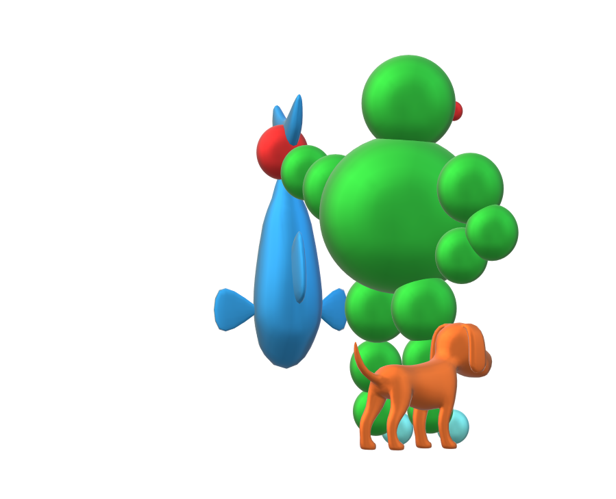

# DOSE HUNTER REPOSITORY

DoseHunter is a stand-alone executable for Varian Eclipse V15.x. DoseHunter automatically collects dose data (dose max, dose min, D95\%, etc.) for a large number of patients in your database. DoseHunter creates a .csv file with your data that can be easily analyzed with Excel, Python...

 Please read the [user guide](https://github.com/uhqd/DoseHunter/blob/master/git%20extra%20files/Dose_Hunter_User_Guide.pdf).

# To cite Dose Hunter
If you like and use Dose Hunter, do not hesitate to tell us. Moreover please add in the "acknowledgement" section of your articles or your slides:

**This work was done using Dose Hunter, a free and open-source tool to extract data from Varian Aria (github.com/uhqd)**

## Authors

**Luc Simon1,2,François-Xavier Arnaud2**

(1)[CRCT](https://www.crct-inserm.fr/), Toulouse, France

(2)[IUCT-Oncopole](https://www.iuct-oncopole.fr/), Toulouse, France

